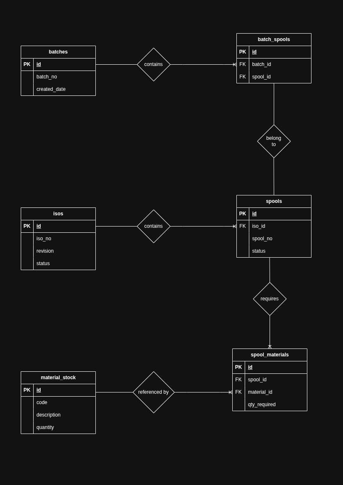

# Fabrication Planning System

A full-stack web application that simulates a fabrication planning workflow where engineering releases ISO drawings for fabrication, each containing spools that require specific materials from warehouse inventory.

## Tech Stack

- **Frontend:** Angular 21, Bootstrap 5, Chart.js
- **Backend:** Spring Boot 4.1, Spring Security, Spring Data JPA, Hibernate 7
- **Database:** PostgreSQL 16
- **Build Tools:** Maven (backend), npm (frontend)

## Prerequisites

- Java 17+
- Node.js 18+ with npm
- PostgreSQL 16+

## Setup Instructions

### 1. Database Setup

```bash
# Connect to PostgreSQL and create the database
psql -U postgres
CREATE DATABASE fabrication_db;
\q
```

The application uses Hibernate `ddl-auto=update`, so tables will be created automatically on first run.

**To load sample data**, execute the SQL script manually:

```bash
psql -U postgres -d fabrication_db -f backend/src/main/resources/schema.sql
psql -U postgres -d fabrication_db -f backend/src/main/resources/data.sql
```

### 2. Backend Setup

```bash
cd backend

# Update database credentials in src/main/resources/application.properties if needed:
# spring.datasource.username=postgres
# spring.datasource.password=motasem123

# Run the application
mvn spring-boot:run
```

The backend starts on **http://localhost:8080**.

### 3. Frontend Setup

```bash
cd frontend

# Install dependencies
npm install

# Start development server
ng serve
# or
npm start
```

The frontend starts on **http://localhost:4200**.

### 4. Authentication

The application uses HTTP Basic Authentication.

- **Username:** `admin`
- **Password:** `admin123`

The Angular frontend automatically includes these credentials via an HTTP interceptor on every request.

## API Endpoints

| Method | Endpoint | Description |
|--------|----------|-------------|
| GET | `/api/v1/materials?page=0&size=10&search=` | List materials (paginated, searchable) |
| POST | `/api/v1/materials` | Create material |
| PUT | `/api/v1/materials/{id}` | Update material |
| DELETE | `/api/v1/materials/{id}` | Delete material |
| GET | `/api/v1/isos?page=0&size=10&search=` | List ISOs (paginated, searchable) |
| POST | `/api/v1/isos` | Create ISO |
| PUT | `/api/v1/isos/{id}` | Update ISO |
| DELETE | `/api/v1/isos/{id}` | Delete ISO (cascades to spools) |
| GET | `/api/v1/isos/{id}` | Get ISO detail with spools |
| GET | `/api/v1/spools?page=0&size=10&search=` | List all spools (paginated, searchable) |
| POST | `/api/v1/isos/{isoId}/spools` | Create spool under ISO |
| PUT | `/api/v1/spools/{id}` | Update spool |
| DELETE | `/api/v1/spools/{id}` | Delete spool |
| POST | `/api/v1/spools/{spoolId}/materials` | Add material requirement to spool |
| DELETE | `/api/v1/spools/materials/{smId}` | Remove material requirement |
| GET | `/api/v1/spools/pending` | List pending spools |
| POST | `/api/v1/batches/generate` | Generate fabrication batch |
| GET | `/api/v1/batches?page=0&size=10` | List batch history |
| GET | `/api/v1/batches/{id}` | Get batch detail with spools |
| GET | `/api/v1/dashboard/metrics` | Get dashboard aggregate metrics |

## Database Design (ERD)

The following Entity-Relationship Diagram illustrates the database schema and the relationships between tables:



**Key Relationships:**
- **ISOs → Spools:** One-to-Many (An ISO contains multiple spools)
- **Spools → Spool Materials:** One-to-Many (A spool requires multiple materials)
- **Material Stock → Spool Materials:** One-to-Many (A material can be required by many spools)
- **Batches → Batch Spools → Spools:** Many-to-Many (A batch contains multiple spools; resolved via junction table)

## Architecture

### Backend (Layered Architecture)

```
com.fabricationplanner.backend
├── config/          # Security, CORS configuration
├── controller/      # REST endpoints (thin controllers)
├── dto/
│   ├── request/     # Incoming payload models with validation
│   └── response/    # Outgoing payload models
├── entity/model/    # JPA entities
├── exception/       # Global exception handler, custom exceptions
├── repository/      # Spring Data JPA interfaces
└── service/         # Business logic (all logic lives here)
```

### Frontend (Feature-based)

```
src/app/
├── components/
│   ├── dashboard/      # Metrics cards + Chart.js doughnut chart
│   ├── material-list/  # CRUD table with search
│   ├── iso-list/       # CRUD table with navigation to detail
│   ├── iso-detail/     # Master-detail: spool + material management
│   ├── spool-list/     # Batch generation engine + spool overview
│   ├── batch-list/     # Historical batch viewer
│   └── navbar/         # Navigation
├── interceptors/       # Basic Auth HTTP interceptor
├── models/             # TypeScript interfaces
└── services/           # HTTP service layer
```

### Batch Generation Algorithm

1. Fetch all spools with status `PENDING` or `PENDING_MATERIAL`.
2. For each spool, check if ALL required materials have sufficient warehouse stock.
3. If all materials are available: deduct quantities from stock, mark spool as `BATCHED`.
4. If any material is insufficient: mark spool as `PENDING_MATERIAL`.
5. Create a `Batch` record containing all successfully batched spools.
6. The entire operation runs within a single `@Transactional` boundary.

## Assumptions

1. **Authentication:** Basic Auth is implemented with a single hardcoded in-memory user (`admin`/`admin123`). No complex JWT or role-based access control was implemented, as the spec states "hardcoded roles is acceptable."

2. **Batching Trigger:** The "Generate Batch" action evaluates ALL available non-batched spools across all ISOs automatically, rather than allowing manual spool selection.

3. **Stock Replenishment:** Material stock quantities are manually managed via the CRUD API. There is no automated procurement or reorder trigger.

4. **Concurrency:** Optimistic locking (`@Version`) is implemented on `MaterialStock` to prevent concurrent stock over-allocation. If two users generate batches simultaneously, one will receive an optimistic lock failure and must retry.

5. **Quantity Precision:** `BigDecimal` is used for all quantities instead of `INT` (as suggested in the spec) to support fractional measurements common in fabrication (e.g., meters of pipe, kilograms of material).

6. **Empty Spools:** Spools with no material requirements defined cannot be batched and will be marked as `PENDING_MATERIAL`.

7. **Deletion Cascade Rules:**
   - Deleting an ISO cascades to delete all its spools and their material requirements.
   - Deleting a material is restricted if it is referenced by any spool requirement (returns 409 Conflict).

8. **Schema Management:** The application uses Hibernate `ddl-auto=update` for development convenience. The `schema.sql` and `data.sql` files are provided as documentation/initialization artifacts.
